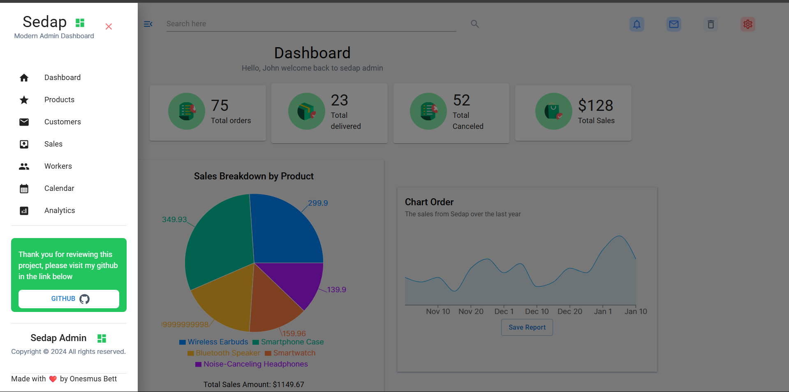
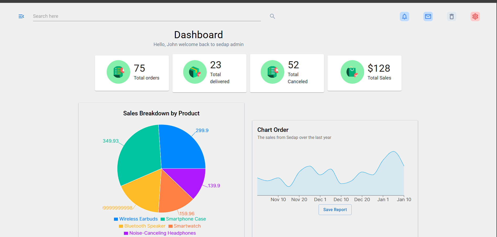
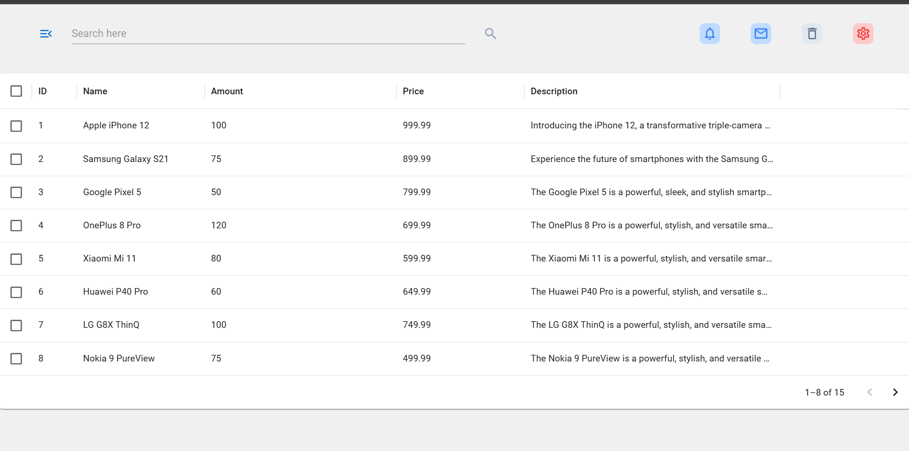
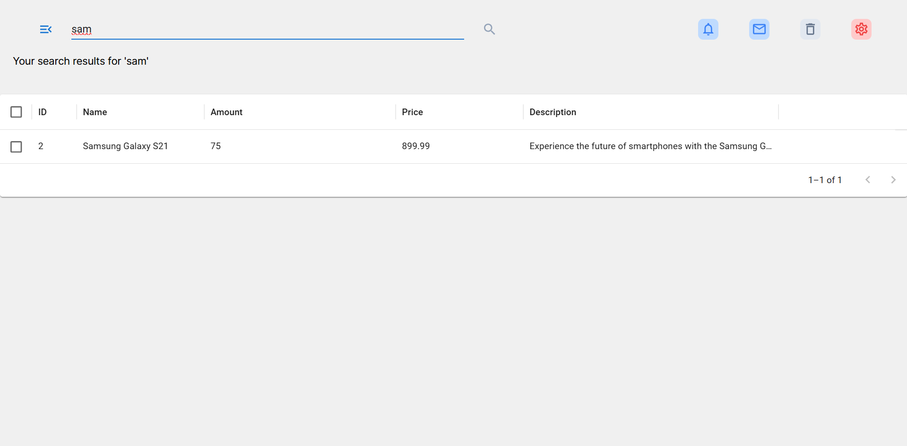

# Sedap Admin Dashboard
## Screenshots
<div>
 
 
 
 
</div>


---

# Express API Server

This is a basic Express API server that provides endpoints for retrieving customer, product, sales, and worker data. The data is sourced from local JSON files, and the server allows users to query specific data using query parameters or URL parameters.

## Features

- **CORS Enabled**: Cross-Origin Resource Sharing (CORS) is enabled, allowing requests from different origins.
- **JSON Response**: All responses are in JSON format.
- **Search Functionality**: Allows searching for customers, products, sales, and workers by name or title.

## Endpoints

### 1. `/customers`
- **GET**: Fetches all customers.
  
  **Example Response:**
  ```json
  [
    {
      "id": 1,
      "name": "John Doe",
      "email": "john@example.com"
    },
    {
      "id": 2,
      "name": "Jane Smith",
      "email": "jane@example.com"
    }
  ]
  ```

### 2. `/customers/:name`
- **GET**: Fetches customers by their name (case-insensitive).
  
  **Example URL**: `/customers/john`
  
  **Example Response:**
  ```json
  [
    {
      "id": 1,
      "name": "John Doe",
      "email": "john@example.com"
    }
  ]
  ```

### 3. `/products`
- **GET**: Fetches all products.
  
  **Example Response:**
  ```json
  [
    {
      "id": 1,
      "title": "Product A",
      "price": 100
    },
    {
      "id": 2,
      "title": "Product B",
      "price": 150
    }
  ]
  ```

### 4. `/products/:title`
- **GET**: Fetches products by their title (case-insensitive).
  
  **Example URL**: `/products/product-a`
  
  **Example Response:**
  ```json
  [
    {
      "id": 1,
      "title": "Product A",
      "price": 100
    }
  ]
  ```

### 5. `/sales`
- **GET**: Fetches all sales data.
  
  **Example Response:**
  ```json
  [
    {
      "id": 1,
      "productName": "Product A",
      "quantity": 2,
      "totalPrice": 200
    },
    {
      "id": 2,
      "productName": "Product B",
      "quantity": 3,
      "totalPrice": 450
    }
  ]
  ```

### 6. `/sales/:productName`
- **GET**: Fetches sales by product name (case-insensitive).
  
  **Example URL**: `/sales/product-a`
  
  **Example Response:**
  ```json
  [
    {
      "id": 1,
      "productName": "Product A",
      "quantity": 2,
      "totalPrice": 200
    }
  ]
  ```

### 7. `/workers`
- **GET**: Fetches all workers.
  
  **Example Response:**
  ```json
  [
    {
      "id": 1,
      "name": "Alice",
      "role": "Manager"
    },
    {
      "id": 2,
      "name": "Bob",
      "role": "Worker"
    }
  ]
  ```

### 8. `/workers/:name`
- **GET**: Fetches workers by their name (case-insensitive).
  
  **Example URL**: `/workers/alice`
  
  **Example Response:**
  ```json
  [
    {
      "id": 1,
      "name": "Alice",
      "role": "Manager"
    }
  ]
  ```

## Setup

To run the server locally, follow these steps:

### 1. Clone the repository:
```bash
git clone https://github.com/onesmuskipchumba0/AdminDashboard.git
cd AdminDashboard/api
```

### 2. Install dependencies:
```bash
npm install
```

### 3. Start the server:
```bash
npm start
```

The server will start running on [http://localhost:3000](http://localhost:3000).

### 4. Test the API:
You can test the API using Postman or any API testing tool, or use your browser for GET requests.

## Dependencies
- `express`: A web framework for Node.js.
- `cors`: Middleware for enabling CORS support.
- `axios` (if using to make requests from front end).
  
## License
This project is licensed under the MIT License - see the [LICENSE](LICENSE) file for details.

---
